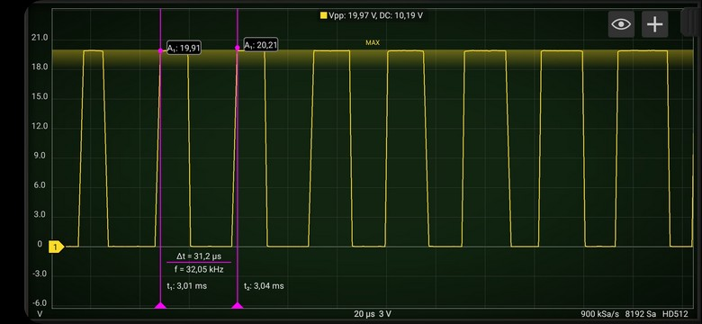
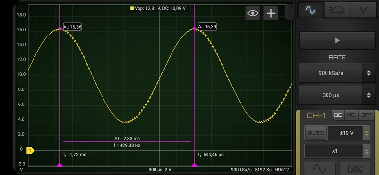

# PWM sinewawe audioplayer
## project name: mbed6_PWM_sinewave
Tested by: **Keil Studio** 1.5.55 and **Mbed-OS** 6.16.0

Plays sinewave audio on a NUCLEO-F446RE card by using the PWM 
output at the PB_0 pin.

The calculated sinwave audiosamples are stored in an float type array.
The valuas are scaled into the region between 0.0 and 1.0. We use these 
data to set the duty cycle of the PWM channel.

## Timing:
We have 36 samples for a complete sine wave therefore we have to play
440*36 samples in one second (i.e. there is a 63 us delay between each sample).
The PWM period should be less then this interval (we arbitrarily selected
of value 31.5 us) so that all set duty values can take effect for at least one 
(or two) PWM period.

**Note:** Due to the lazy timing (wait_us() delay function was used instead of hardware timing) 
the frequency is somewhat lower than the nominal value (429 Hz instead of 440 Hz). 
This is quite understandable, since we did not take into account the execution time
of the instructions in the endless loop. 

### Reference: 
[AnalogOut class reference](https://os.mbed.com/docs/mbed-os/v6.15/apis/analogout.html) 

## Hardware requirements
* NUCLEO-F446RE development board
* Active speaker or oscilloscope connected to the PA_4 pin (this is the pin labeled as A2 on the board)
* You may also need an RC filter or voltage diveder at the output pin

## mbed6_PWM_sinewave results

In the raw output signal we can oly see that the duty cycle is changing and the PWM period is nearly 
the same as expected (however, we cannot measure it accurately since our oscilloscope can collect 
900 ksamples/s).

When a simple RC low pass filter was applied (R = 1k, C = 470nF) the output signal became quite nice, 
but the peak-to-peak amplitude was decreased from 3.3 V to 2.1 V.

**Note:** The vertical scale is in arbitrary units, actually the 20.0 value corresponds to 3.3 V.